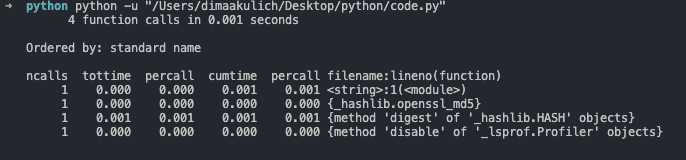

Источник: https://python-scripts.com/cprofile-code-profiling

Все что вам нужно сделать, это импортировать модуль и вызвать его функцию run.

```python
#code.py
import hashlib
import cProfile
 
cProfile.run("hashlib.md5(b'abcdefghijkl').digest()")
```



Здесь мы импортировали модуль hashlib и использовали cProfile для профилирования того, что создал хеш MD5. Первая строка показывает, что в ней 4 вызова функций. Следующая строка говорит нам, в каком порядке результаты выдачи. Здесь есть несколько столбцов.

- ```ncalls``` – это количество совершенных вызовов;
- ```tottime``` – это все время, потраченное в данной функции;
- ```percall``` – ссылается на коэффициент tottime, деленный на ncalls;
- ```cumtime``` – совокупное время, потраченное как в данной функции, так и наследуемых функциях. Это работает также и с рекурсивными функциями!
- Второй столбец ```percall``` – это коэффициент cumtime деленный на примитивные вызовы;
- ```filename:lineno(function)``` предоставляет соответствующие данные о каждой функции.

# Пример 1

**Примитивный вызов** – это вызов, который не был совершен при помощи рекурсии. Это очень интересный пример, так как здесь нет очевидных узких мест.

```python
#code2.py
# -*- coding: utf-8 -*-
import time
 
def fast():
    print("Я быстрая функция")
 
def slow():
    time.sleep(3)
    print("Я очень медленная функция")

def medium():
    time.sleep(0.5)
    print("Я средняя функция...")
 
def main():
    fast()
    slow()
    medium()
 
if __name__ == '__main__':
    main()
```

```python
#code2test.py
import cProfile
import ptest
 
cProfile.run('ptest.main()')
```


Можно также **вызвать cProfile** в командной строке, вместо применения в интерпретаторе. Как это сделать:

```bash
python -m cProfile ptest.py
```

Но что если вам нужно **сохранить выдачу профайлера**? Что-ж, это очень просто с **cProfile**! Все что вам нужно, это передать ему команду **–o**, за которой следует название (или путь) файла выдачи. Вот пример:

```bash
python -m cProfile -o output.txt ptest.py
```

К сожалению, выдаваемый файл едва ли можно назвать читаемым. Если вы хотите прочесть файл, тогда вам нужно использовать модуль Python **pstats**. Вы можете использовать pstats для форматирования выдачи разными способами. Вот небольшой код, который показывает, как получить выдачу, по аналогии с тем, как мы делали это раньше:

```python
import pstats
p = pstats.Stats("output.txt")
 
p.strip_dirs().sort_stats(-1).print_stats()
```
